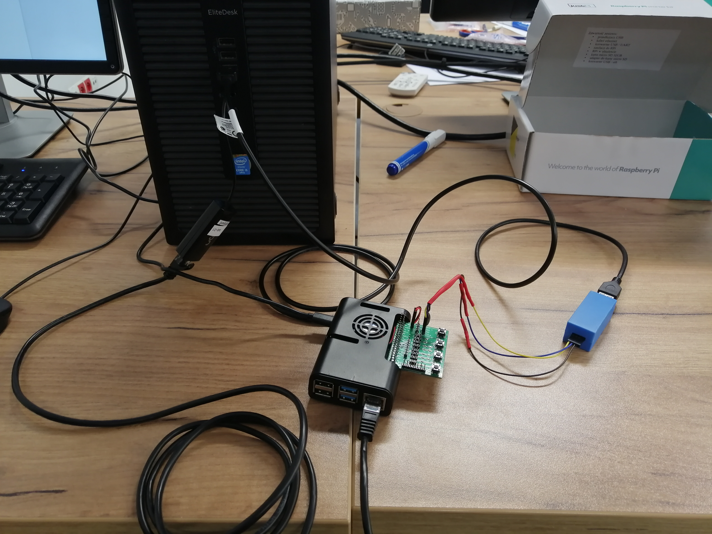
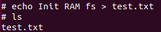

# [SKPS] - Laboratorium 1

## Zadania
1. [x] Złożenie stanowiska laboratoryjnego: zestaw z Raspberry Pi 4B (RPi),
2. [x] Pierwsze uruchomienie RPi, sprawdzenie połączenia sieciowego, wykonanie próbnych transferów plików,
3. [x] Zbudowanie za pomocą Buildroot obrazu Linuxa dla RPi, z init RAM fs,
4. [x] Zbudowanie za pomocą Buildroot obrazu Linuxa dla RPi, z systemem plików na trwałym nośniku.

## Przygotowanie stanowiska

Podłączyliśmy urządnie RPi zgodnie ze schematem dołączonym do skryptu laboratoryjnego.

Prowadzący zweryfikował poprawność połączenia.

## Pierwsze uruchomienie RPi

Uruchomiliśmy terminal UART za pomocą programu tio `tio /dev/ttyUSB0`.

Następnie włączyliśmy zasilanie i zalogowaliśmy się do urządenia.

Po zalogowaniu uruchomiliśmy DHCP `udhcpc` i sprawdziliśmy adresy IP urządzeń `ifconfig`.

- Adres IP hosta: 10.42.0.1
- Adres IP RPi: 10.42.0.230

Dodatkowo sprawdzilimy, czy połączanie działa poprawnie `ping <ip>`

## Kopiowanie plików na RPi

Na komputerze hosta stworzyliśmy plik testowy oraz uruchomiliśmy server HTTP `python3 -m http.server`, w celu umożliwienia przesyłania plików.

Następnie wykonaliśmy próbny transfer plików, który zakończył się pomyślnie

## Kompilacja obrazu Linuxa w Buildroot dla Raspberry Pi 4B z initramfs

Pobraliśmy i rozpakowaliśmy obraz buildroot `wget https://buildroot.org/downloads/buildroot-2022.02.tar.xz`, `tar -xaf buildroot-2022.02.tar.xz`.

Uruchomiliśmy domyślną konfigurację urządzenia `make raspberrypi4_64_defconfig`.

Następnie przeszliśmy do konfiguracji `make menuconfig`, gdzie Zaznaczyliśmy następujące funkcje External toolchain, initramfs, kompresję i odznaczyliśmy funkcję ext2/3/4. Dodatkowo zmieliliśmy nazwę hosta.
- Toolchain -> Toolchain Type -> External
- Filesystem images -> cpio the root filesystem -> Compression method -> gzip [x]
- Filesystem images -> initial RAM filesystem linked into linux kernel [x]
- Filesystem images -> ext2/3/4 root filesystem [ ]
- System configuration -> System hostname -> Brzozowski_Krawczyk

Po zmianach uruchomiliśmy kompilację poleceniem `make`.

## Uruchomienie zbudowanego obrazu

Zamontowaliśmy partycję 1 karty SD, w katalagu /mnt `mount /dev/mmcblk0p1 /mnt`.

W folderze output/images uruchomiliśmy server HTTP.

Przesłaliśmy pliki: `Image`, ` cmdline.txt`, `bcm2711-rpi-4-b.dtb` poleceniem `wget http://10.42.0.1:8000/<adres_pliku>`

Uruchomiliśmy ponownie urządzenie `reboot` przytrzymując przycisk SW4.

System uruchomił się bez żadnych komplikacji.

Utworzyliśmy plik test.txt, uruchomiliśmy ponownie urządzenie i zgodnie z oczekiwaniami plik zniknął.

Zapisaliśmy konfigurację pliku .config pod nazwą config_initramfs.

## Kompilacja obrazu Linuxa w Buildroot dla Raspberry Pi 4B bez initramfs

Usunęliśmy poprzedni obraz `make linux-dirclean`.

Następnie przeszliśmy do konfiguracji `make menuconfig`, gdzie zaznaczyliśmy następujące funkcje: External toolchain, funkcję ext2/3/4, kompresję i odznaczyliśmy initramfs
- Toolchain -> Toolchain Type -> External
- Filesystem images -> cpio the root filesystem -> Compression method -> gzip [x]
- Filesystem images -> initial RAM filesystem linked into linux kernel [ ]
- Filesystem images -> ext2/3/4 root filesystem [x] -> ext2
- System configuration -> System hostname -> Brzozowski_Krawczyk

Po zmianach uruchomiliśmy kompilację poleceniem `make`.

Kompilacja zakończyła się błędem, tak więc musieliśmy zwiększyć rozmiar systemu plików do 256 MiB.

Wynikowy obraz Image jest mniejszy od obrazu z ramdyskiem startowym, ponieważ nie zawiera on systemu plików, znajduje się w nim tylko system rozruchowy.

## Uruchomienie zbudowanego obrazu

Zamontowaliśmy partycję 1 karty SD, w katalagu /mnt `mount /dev/mmcblk0p1 /mnt`.

W folderze output/images uruchomiliśmy server HTTP.

Przesłaliśmy pliki: `Image`, ` cmdline.txt`, `bcm2711-rpi-4-b.dtb`, ` rootfs.ext2` poleceniem `wget http://10.42.0.1:8000/<adres_pliku>`

Dodatkowo plik `rootfs.ext2` nagraliśmy na drugiej partycji `dd if=rootfs.ext2 of=/dev/mmcblk0p2 bs=4096`.

Uruchomiliśmy ponownie urządzenie `reboot` przytrzymując przycisk SW4.

System uruchomił się bez żadnych komplikacji.

W celu zweryfikowania poprawności skonfigurowania systemu Buildroot w głównym katalogu utowrzyliśmy plik test.txt.

Następnie uruchomiliśmy urządzenie ponownie `reboot` i sprawdziliśmy zawartość głównego katalogu `ls`.

Jak możemy zauważyć system został skonfigurowany w sposób poprawny. Po ponownym uruchomieniu nadal dostępna jest zawartość plików.

Zapisaliśmy konfigurację pliku .confing pod nazwą config_fs_ext2.

# Autorzy:
- Mateusz Brzozowski, 310608
- Bartłomiej Krawczyk, 310774
