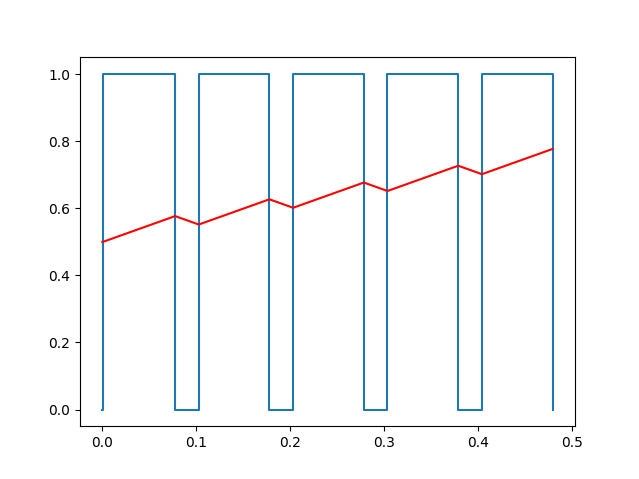
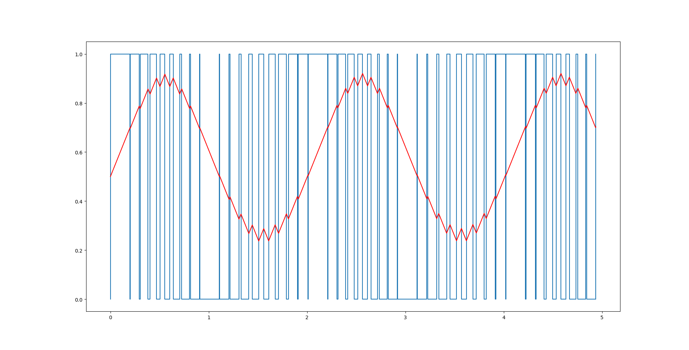
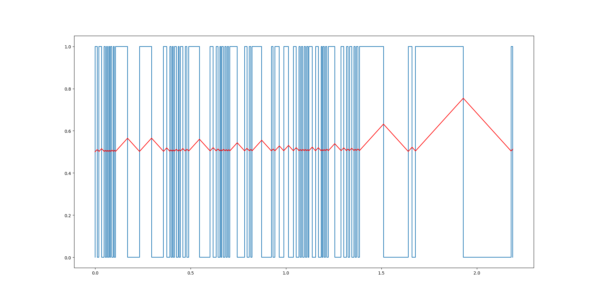

## Uruchomienie i skonfigurowanie OpenWRT dla maszyny wirtualnej i uruchomienie na qemu


1. Pobieramy obraz systemu operacyjnego:

`wget https://downloads.openwrt.org/releases/21.02.1/targets/armvirt/64/openwrt-21.02.1-armvirt-64-Image -O Image`

2. Pobiramy obraz systemu plików:

`wget https://downloads.openwrt.org/releases/21.02.1/targets/armvirt/64/openwrt-21.02.1-armvirt-64-rootfs-ext4.img.gz -O rootfs.ext4.gz`

3. Wypakowujemy obraz systemu plików:

`gzip -d rootfs.ext4.gz`

4. Uruchamiamy system:

```sh
qemu-system-aarch64 \
    -M virt -cpu cortex-a57 -nographic -smp 4 \
    -kernel Image -append "root=/dev/vda console=ttyAMA0" \
    -drive file=rootfs.ext4,if=none,format=raw,id=hd0 \
    -device virtio-blk-device,drive=hd0 \
    -nic user,hostfwd=tcp::8889-:80,hostfwd=tcp::8888-:22
```

5. Edytujemy plik konfiguracyjny sieci, tak aby umożliwić przesyłanie plików na OpenWRT:

`vi /etc/config/network`
```
config interface 'lan'
        option device 'br-lan'
        option proto 'dhcp'
#       option ipaddr '192.168.1.1'
#       option netmask '255.255.255.0'
#       option ip6assign '60'
```
6. Uruchamiamy ponownie kartę sieciową:

`/etc/init.d/network reload`

7. Usuwamy zbiór uruchamiający server DNS/DHCP dnsmasq:

`rm /etc/rc.d/S19dnsmasq`

## Implementacja w języku Python oraz uruchomienie w OpenWRT / qemu dwóch programów generujących sygnał PWM

1. Aktualizujemy pakiety na OpenWRT:

`opkg update`

2. Instalujemy na OpenWRT Pythona3:

`opkg install python3`

3. Przesyłamy pliki generujące sygnał pwm:

`scp -P 8888 pwm.py "root@localhost:~"`
`scp -P 8888 pwm_variable_duty_cycle.py "root@localhost:~"`
`scp -P 8888 pwm_variable_frequency.py "root@localhost:~"`

### Generacja sygnałów o stałym wypełnieniu i częstotliwości

1. Uruchamiamy program `pwm.py`

`python3 pwm.py`

2. Kopiujemy rezultat na komputer z dostępnym gui:

`scp -P 8888 "root@localhost:fixed_duty_cycle_and_frequency.txt" output/`

3. Wynik programu generującego sygnał pwm o zmiennym wypełnieniu:

`python3 plot.py < output/fixed_duty_cycle_and_frequency.txt`



### Generacja sygnałów o zmiennym wypełnieniu

1. Uruchamiamy program `pwm_variable_duty_cycle.py`

`python3 pwm_variable_duty_cycle.py`

2. Kopiujemy rezultat na komputer z dostępnym gui:

`scp -P 8888 "root@localhost:variable_duty_cycle.txt" output/`

3. Wynik programu generującego sygnał pwm o zmiennym wypełnieniu:

`python3 plot.py < output/variable_duty_cycle.txt`



### Generacja sygnałów o zmiennej częstotliwości

1. Uruchamiamy program `pwm_variable_frequency.py`

`python3 pwm_variable_frequency.py > variable_frequency.txt`

2. Kopiujemy rezultat na komputer z dostępnym gui:

`scp -P 8888 "root@localhost:variable_frequency.txt" output/`

3. Wynik programu generującego sygnał pwm o zmiennej częstotliwości:

`python3 plot.py < output/variable_frequency.txt`




