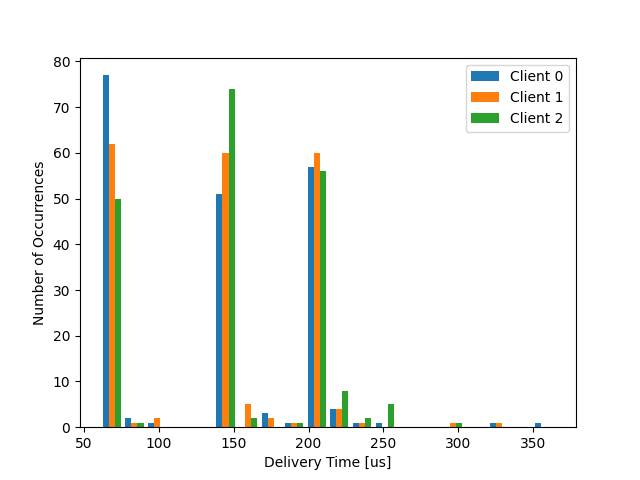
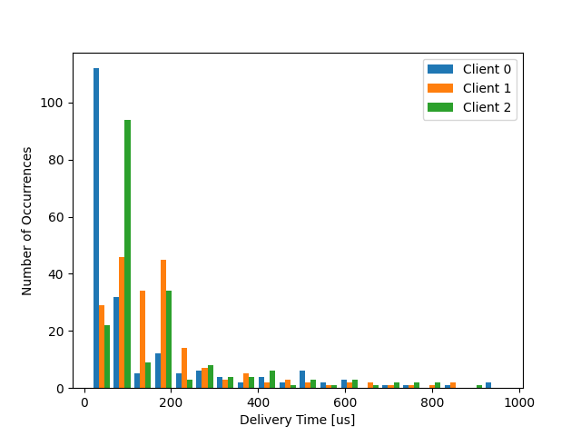
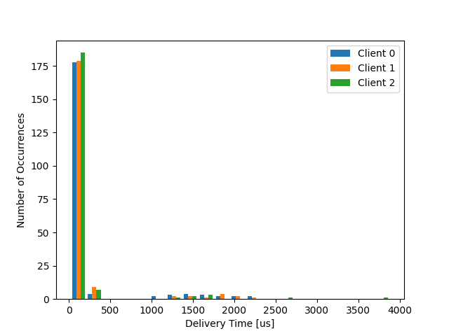
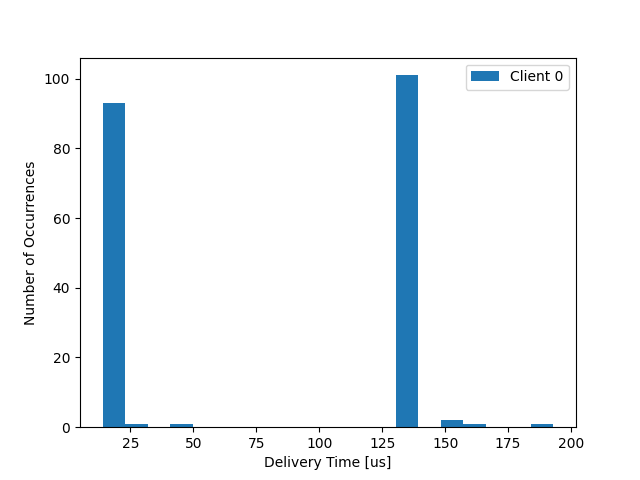
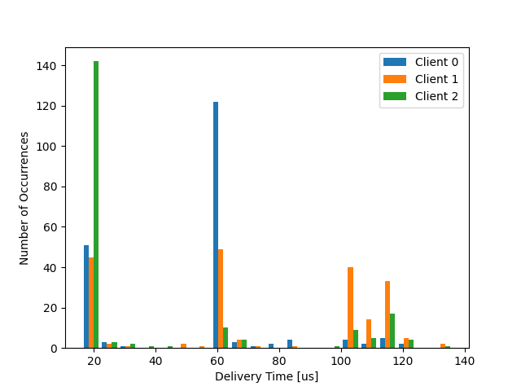
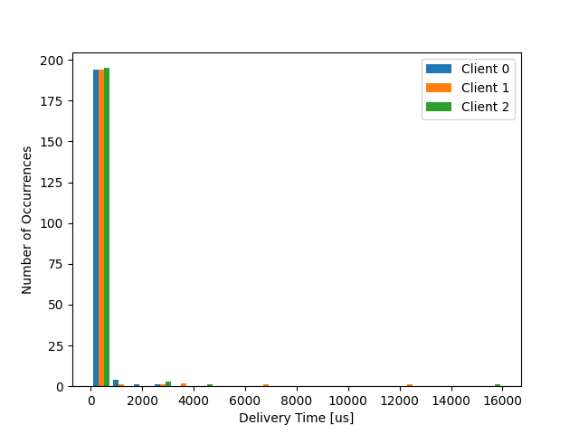
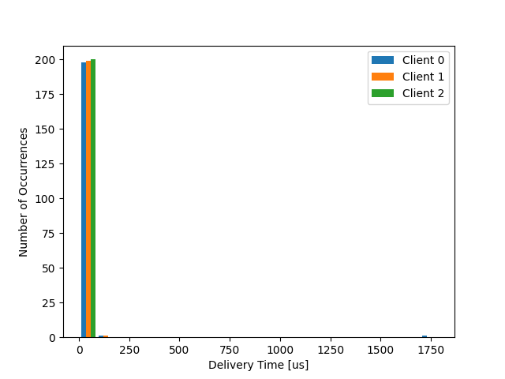

# [SKPS] - Laboratorium 4

Przedmiot:
Systemy komputerowe w sterowaniu i pomiarach

Mateusz Brzozowski, Bartłomiej Krawczyk

# Plan laboratorium
1. [ ] Przetestowanie działania programów na “gospodarzu”
2. [ ] Zbudowanie pakietu dla OpenWRT
3. [ ] Ustalenie granicznej wartości czasu przetwarzania
4. [ ] Rozkład czasu dostarczenia danych
5. [ ] Aktywne oczekiwanie
6. [ ] Właściwy pomiar czasu

## Ustalenie granicznej wartości czasu przetwarzania

| Wariant  | Czas przetwarzania |
|----------|--------------------|
| Pierwszy | 340 000            |
| Drugi    | 485 000            |
| Trzeci   | 595 000            |
| Czwarty  | 753 000            |

Parametry:
- Liczba próbek : 1000
- Okres próbkowania : 10 000

## Rozkład czasu dostarczenia danych

### Pierwszy Wariant
3 klientów, 1 rdzeń, pełne obciążenie, czas przetwarzania 170 000

### Drugi Wariant
3 klientów, 2 rdzenie, pełne obciążenie, czas przetwarzania 242 500

### Trzeci Wariant
3 klientów, 2 rdzenie, pełne obciążenie, czas przetwarzania 297 500

### Czwarty Wariant
1 klientów, 4 rdzenie, pełne obciążenie, czas przetwarzania 376 500

## Aktywne oczekiwanie

Parametry:
- Liczba rdzeni : 4
- Liczba klientów : 3
- Obciążenie: brak
- Liczba próbek : 200
- Okres próbkowania : 10 000
- Czas przetwarzania : 300 000

### Zerowy wariant

### Pierwszy Wariant
aktywne oczekiwanie klienta numer 0

### Drugi Wariant
aktywne oczekiwanie wszystkich klientów

## Właściwy pomiar czasu

Parametry:
- Liczba rdzeni : 4
- Liczba klientów : 3
- Obciążenie: brak
- Liczba próbek : 100
- Okres próbkowania : 10 000
- Czas przetwarzania : 376 500

### Zerowy Wariant

### Pierwszy Wariant

-  Czy rzeczywiście okres między pobraniami zestawów próbek jest właściwy?

Nie jest on właściwy.

- Proszę wyjaśnić obserwowany efekt.

Funkcja `usleep`:
- nie bierze pod uwagę czasu, w którym jedna iteracja pętli jest wykonywana
- gwarantuje, że proces jest uśpiony określoną ilość `μs`, ale ilość ta może być większa
