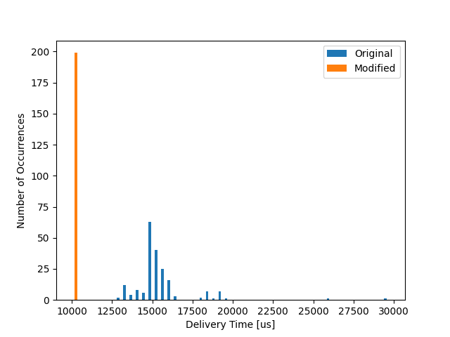

# [SKPS] - Laboratorium 4

Przedmiot:
Systemy komputerowe w sterowaniu i pomiarach

Mateusz Brzozowski, Bartłomiej Krawczyk

# Plan laboratorium
1. [ ] Przetestowanie działania programów na “gospodarzu”
2. [ ] Zbudowanie pakietu dla OpenWRT
3. [ ] Ustalenie granicznej wartości czasu przetwarzania
4. [ ] Rozkład czasu dostarczenia danych
5. [ ] Aktywne oczekiwanie
6. [ ] Właściwy pomiar czasu

## Ustalenie granicznej wartości czasu przetwarzania

| Wariant  | Czas przetwarzania |
|----------|--------------------|
| Pierwszy | XXX XXX            |
| Drugi    | XXX XXX            |
| Trzeci   | XXX XXX            |
| Czwarty  | XXX XXX            |

Parametry:
- Liczba próbek : 100
- Okres próbkowania : 10 000

## Rozkład czasu dostarczenia danych

### Pierwszy Wariant
3 klientów, 1 rdzeń, pełne obciążenie, czas przetwarzania XXX XXX

### Drugi Wariant
3 klientów, 2 rdzenie, pełne obciążenie, czas przetwarzania XXX XXX

### Trzeci Wariant
3 klientów, 2 rdzenie, pełne obciążenie, czas przetwarzania XXX XXX

### Czwarty Wariant
1 klientów, 4 rdzenie, pełne obciążenie, czas przetwarzania XXX XXX

## Aktywne oczekiwanie

Parametry:
- Liczba rdzeni : 4
- Liczba klientów : 3
- Obciążenie: brak
- Liczba próbek : 100
- Okres próbkowania : 10 000
- Czas przetwarzania : XXX XXX

### Pierwszy Wariant
aktywne oczekiwanie klienta numer 0

### Drugi Wariant
aktywne oczekiwanie wszystkich klientów

## Właściwy pomiar czasu

Parametry:
- Liczba rdzeni : 4
- Liczba klientów : 3
- Obciążenie: brak
- Liczba próbek : 100
- Okres próbkowania : 10 000
- Czas przetwarzania : XXX XXX

### Pierwszy Wariant

-  Czy rzeczywiście okres między pobraniami zestawów próbek jest właściwy?

Nie jest on właściwy.

- Proszę wyjaśnić obserwowany efekt.