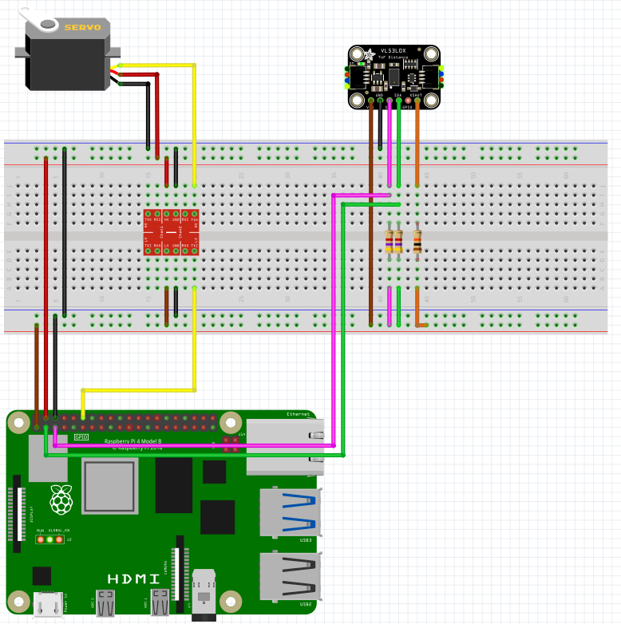

# [SKPS] - Laboratorium 4

Przedmiot:
Systemy komputerowe w sterowaniu i pomiarach

Mateusz Brzozowski, Bartłomiej Krawczyk

## Praca domowa 1
1. [X] Wybranie tematu
2. [X] Opis działania
3. [X] Schemat
4. [ ] Opracowanie szkieletu pakietu OpenWRT,
5. [ ] Zbudowanie go dla qemu i uruchomienie na qemu.

## Praca domowa 2
1. [ ] Opracowanie interfejsu graficznego działającego na komputerze PC


# Lidar na bazie czujnika odległości time of flight i serwomechanizmu

## Opis działania

### Główny program na RPI

```py
while Dokonuj pomiaru:
    Obrót serwomechanizmu o niewielki_kąt
    Wykonanie pomiaru odległości za pomocą czujnika time of flight
    Pobierz mutex od bufora
    Zapis pomiaru oraz aktualnego kąta do bufora
    Zwolnij mutex
    if kąt == 0 lub 360:
        niewielki_kąt = -niewielki_kąt
```

### Dodatkowy proces na RPI

```py
while Dokonuj pomiaru:
    Pobierz mutex od bufora
    Odczytaj dane z bufora
    Zwolnij mutex
    Prześlij odczytane dane do komputera
```

### Główny program na PC

```py
while Dokonuj pomiaru:
    Oczekuj na pomiar
    Przetwórz kąt i odległość na współrzędne x i y
    Zapisz dane do listy o stałej długości (odpowiednio nadpisując stare dane)
    Na podstawie danych z listy wygeneruj wykres
```

# Schemat Połączeń

