# [SKPS] - Laboratorium 4

Przedmiot:
Systemy komputerowe w sterowaniu i pomiarach

Mateusz Brzozowski, Bartłomiej Krawczyk

## Praca domowa 1
1. [X] Wybranie tematu
2. [X] Opis działania
3. [X] Schemat
4. [X] Opracowanie szkieletu pakietu OpenWRT,
5. [X] Zbudowanie go dla qemu i uruchomienie na qemu.

## Praca domowa 2
1. [X] Opracowanie interfejsu graficznego działającego na komputerze PC


# Lidar na bazie czujnika odległości time of flight i serwomechanizmu

## Opis działania

### Główny program na RPI

```py
while Dokonuj pomiaru:
    Obrót serwomechanizmu o niewielki_kąt
    Wykonanie pomiaru odległości za pomocą czujnika time of flight
    Zapis pomiaru oraz aktualnego kąta do kolejki komunikatów
    if kąt == 0 lub 180:
        niewielki_kąt = -niewielki_kąt
```

### Dodatkowy proces na RPI

```py
while Dokonuj pomiaru:
    Odczytaj dane z kolejki komunikatów
    Prześlij odczytane dane do komputera
```

### Główny program na PC

```py
while Dokonuj pomiaru:
    Oczekuj na pomiar
    Przetwórz kąt i odległość na współrzędne x i y
    Zapisz dane do listy o stałej długości (odpowiednio nadpisując stare dane)
    Na podstawie danych z listy wygeneruj wykres
```

# Schemat Połączeń


# Połączenie PC - QEMU

|                                    |                                    |                                    |
|------------------------------------|------------------------------------|------------------------------------|
| 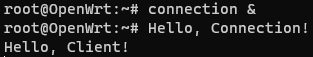 | 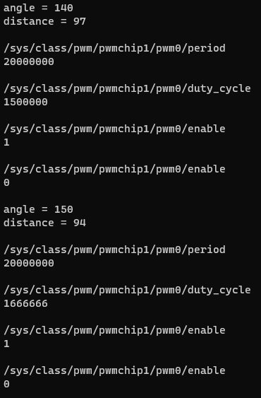 | 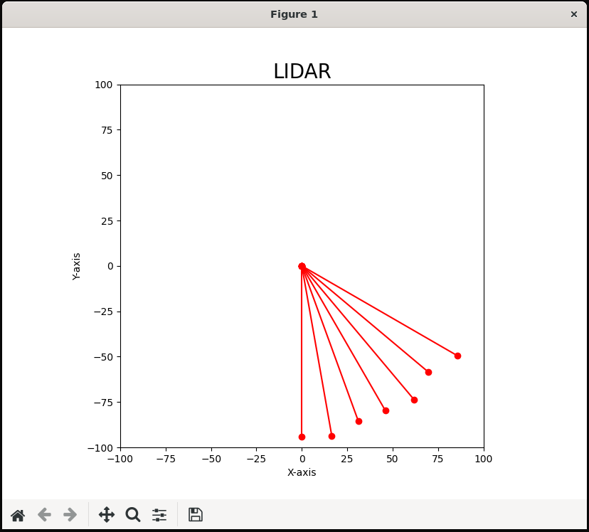 |


# Gotowy projekt

|                                | <div style=visibility:hidden>xxxxxxxxxxxxxxxxxxxxxxxxxxxxxxxxxxxxxxxxxxxxxxxxx</div> |
|--------------------------------|--------------------------------------------------------------------------------------|
| 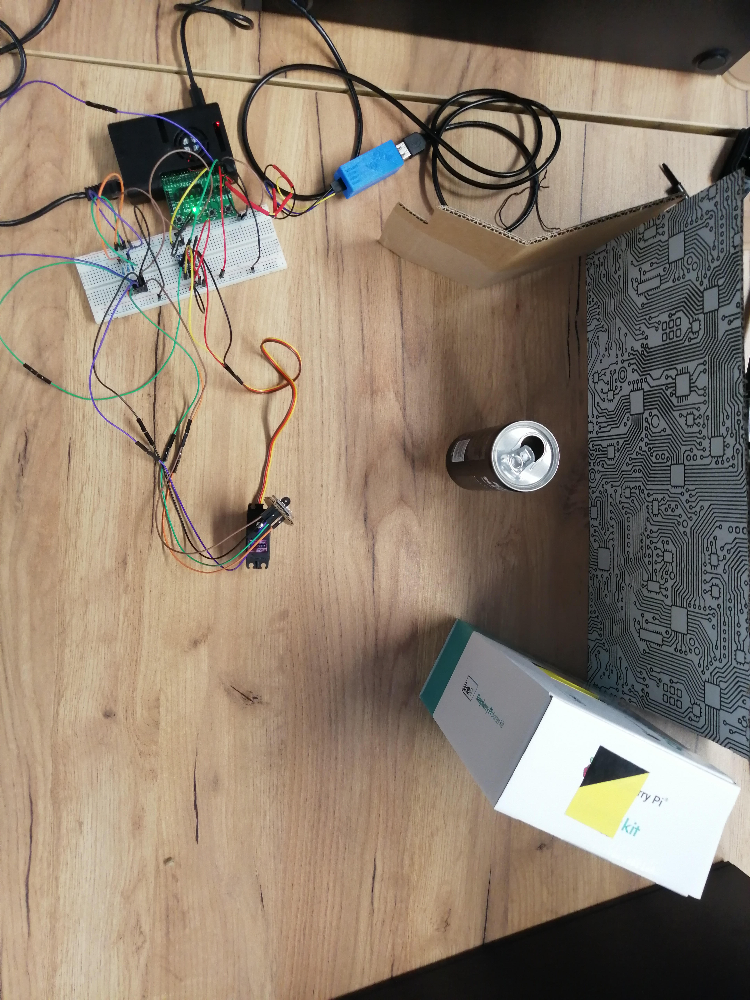 | 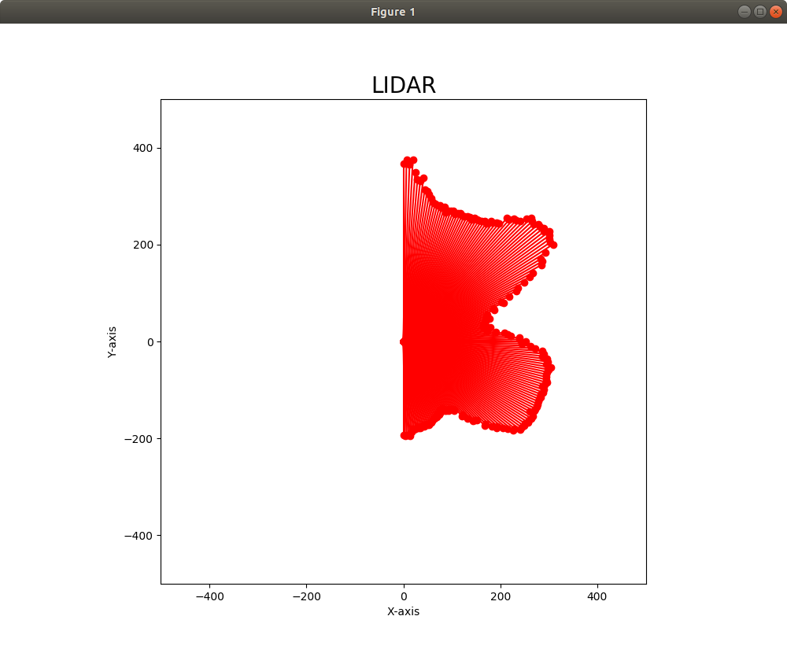                                                            |
| 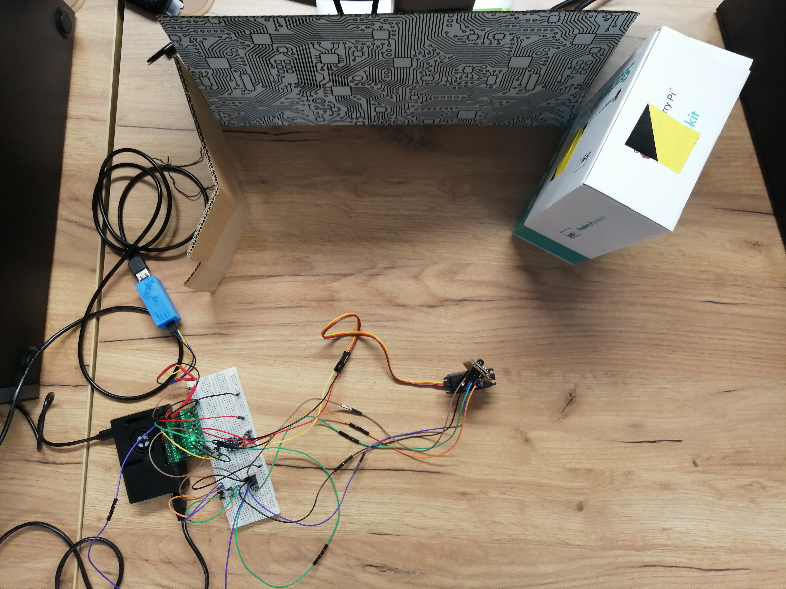 | 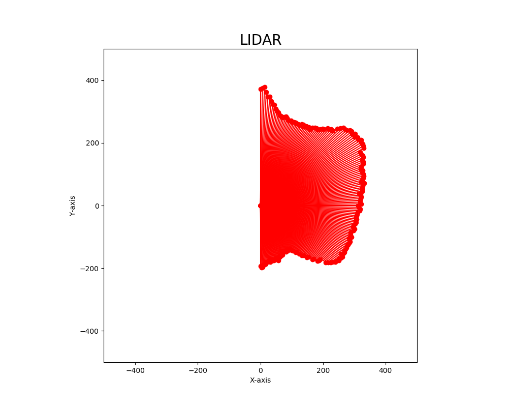                                                            |


|                           |                           |
|---------------------------|---------------------------|
|  | 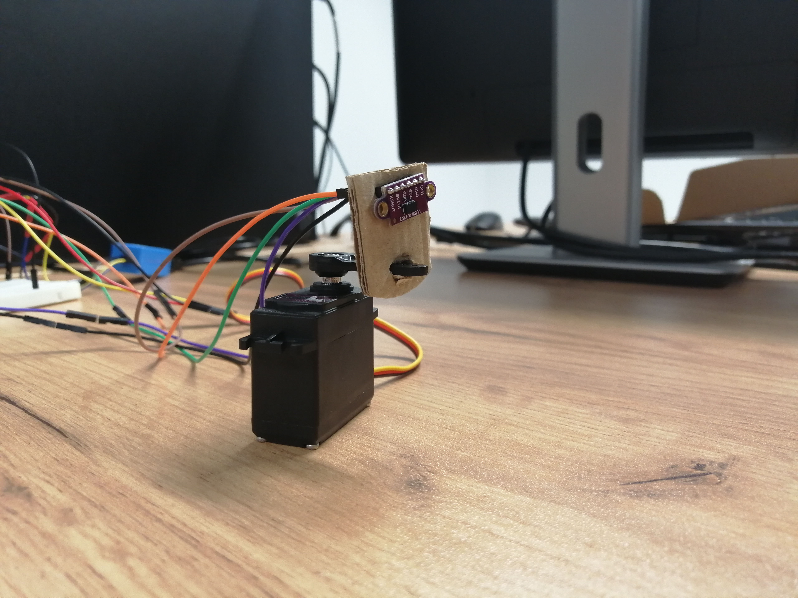 |
| 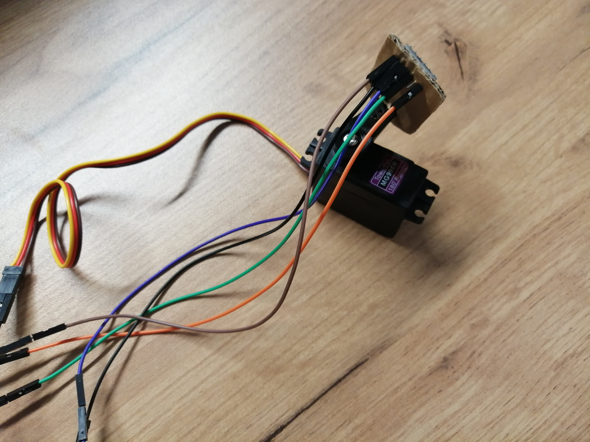 | 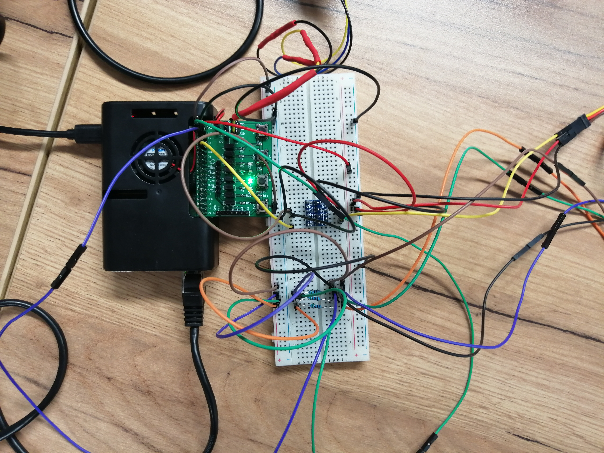 |
| 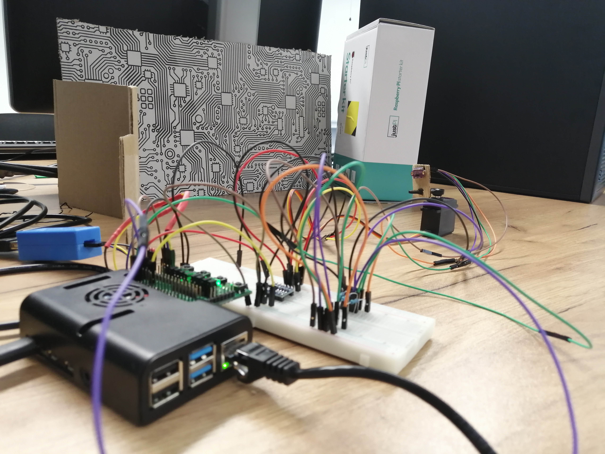 | 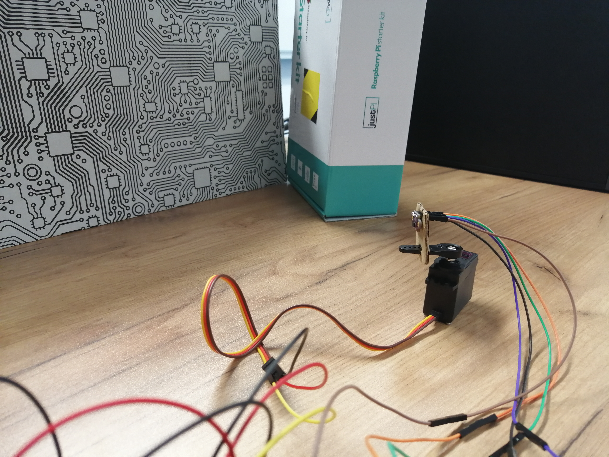 |

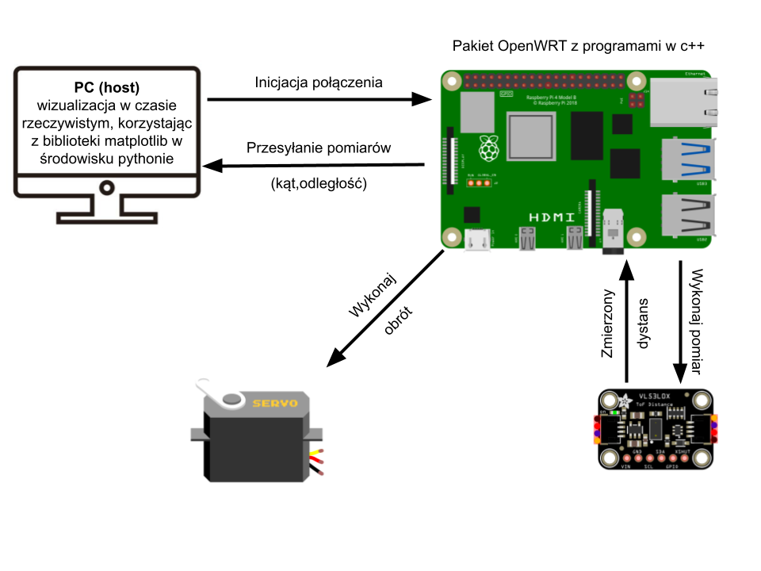

# Pomocne Linki

VL53L0 - laserowy czujnik odległości (time of flight):
- https://download.kamami.pl/p570404-VL53L0X%20Datasheet.pdf
- https://github.com/cassou/VL53L0X_rasp
- https://github.com/cassou/VL53L0X_rasp/blob/master/examples/vl53l0x_SingleRanging_Long_Range_Example.c
- https://www.st.com/en/embedded-software/stsw-img005.html
- I2C:
	- https://moodle.usos.pw.edu.pl/pluginfile.php/260278/mod_resource/content/1/SKPS%20-%20opis%20urz%C4%85dze%C5%84.pdf
	- https://github.com/cassou/VL53L0X_rasp/blob/master/examples/vl53l0x_SingleRanging_Long_Range_Example.c

UDP Server:
- https://www.geeksforgeeks.org/udp-server-client-implementation-c/
- Czekanie na zdarzenie na deskryptorze plików:
    - https://man7.org/linux/man-pages/man2/poll.2.html

UDP Client:
- https://wiki.python.org/moin/UdpCommunication

Kolejki komunikatów:
- https://man7.org/linux/man-pages/man2/mq_open.2.html
- https://w3.cs.jmu.edu/kirkpams/OpenCSF/Books/csf/html/MQueues.html
- Wykład 4:
    - https://moodle.usos.pw.edu.pl/pluginfile.php/217384/mod_folder/content/0/WZ_W04_Komunikacja_mi%C4%99dzyprocesowa.pdf?forcedownload=1
- Czekanie na zdarzenie na deskryptorze plików:
    - https://man7.org/linux/man-pages/man2/poll.2.html

Servo:
- https://en.wikipedia.org/wiki/Servo_control
- PWM - ustawienia i obsługa:
	- https://jumpnowtek.com/rpi/Using-the-Raspberry-Pi-Hardware-PWM-timers.html
- pisanie do pliku:
	- https://www.cplusplus.com/doc/tutorial/files/

Matplotlib:
- updating in real time:
	- https://www.delftstack.com/howto/matplotlib/how-to-automate-plot-updates-in-matplotlib/
	- https://www.geeksforgeeks.org/how-to-update-a-plot-in-matplotlib/
- fixed aspect ratio:
	- https://matplotlib.org/3.1.1/api/_as_gen/matplotlib.axes.Axes.set_aspect.html